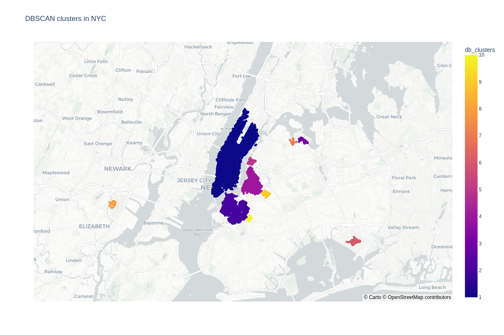
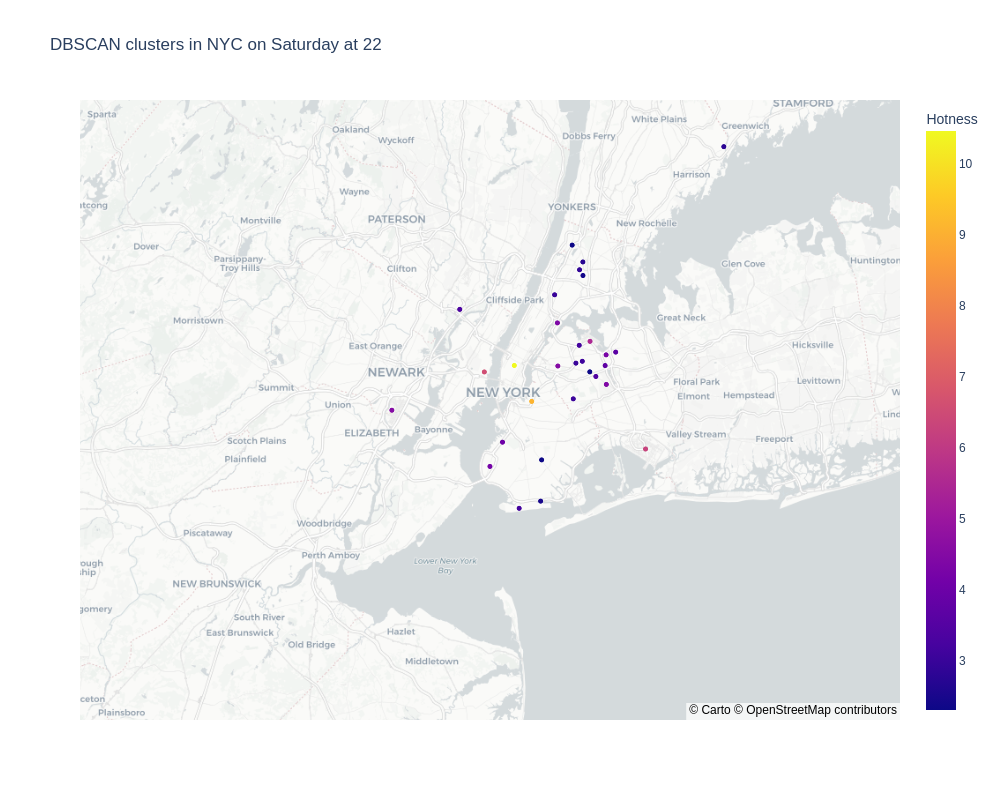

  

# Unsupervised Machine Learning project - AUBER Pickups

This project has been presented as part of my **Machine Learning Engineer certificate** for the Jedha Data Fullstack program.

## Company

<a href="http://uber.com/" target="_blank">Uber</a> is one of the most famous startup in the world. It started as a ride-sharing application for people who couldn't afford a taxi. Now, Uber expanded its activities to Food Delivery with <a href="https://www.ubereats.com/fr-en" target="_blank">Uber Eats</a>, package delivery, freight transportation and even urban transportation with <a href="https://www.uber.com/fr/en/ride/uber-bike/" target="_blank"> Jump Bike</a> and <a href="https://www.li.me/" target="_blank"> Lime </a> that the company funded. 

The company's goal is to revolutionize transportation accross the globe. It operates now on about 70 countries and 900 cities and generates over $14 billion revenue! 😮

## Project an Goals

1. **Data Collection and Preprocessing :**
Gather data about driver locations and timestamps. Each data point should contain information about the driver's latitude, longitude, and timestamp.
Preprocess the data by removing outliers, handling missing values, and converting timestamps to relevant formats.

2. **Feature Engineering :**
Create additional features that might be relevant, such as day of the week and time of day from the timestamps.

3. **Unsupervised Algorithm Selection :**
Choose unsupervised clustering algorithms like KMeans and DBScan to identify hot-zones in the driver data.
These algorithms will group together data points (driver locations) that are close to each other in space.

4. **Algorithm Implementation :**
Implement the chosen unsupervised algorithms using a library like scikit-learn.

5. Hot-Zone Detection:
Apply the selected algorithms to the preprocessed data to cluster driver locations into hot-zones.
The algorithms will identify groups of driver locations that are spatially close.

6. **Visualization :**
Use a Python library like plotly to create an interactive map dashboard.
Plot the clusters (hot-zones) on the map, with different colors for each cluster.
Add functionality to toggle between days of the week to visualize hot-zones per day.

7. **Interpretation and Analysis :**
Analyze the results to identify the most frequent hot-zones for each day of the week.
Determine if there are patterns in the hot-zones that are consistent across different days.

8. **Algorithm Comparison :**
Apply both KMeans and DBScan algorithms to the data separately.
Compare the results of the two algorithms in terms of the number of clusters and the characteristics of the hot-zones they identify.
Evaluate which algorithm performs better based on your specific goals and the nature of the data.

9. **Refinement and Iteration :**
Experiment with different parameters of the algorithms to fine-tune their performance.
Consider additional techniques like density-based analysis or silhouette scores to enhance the quality of clustering.

10. **Documentation and Reporting :**
Document the entire process, including data preprocessing, algorithm implementation, visualization, and results interpretation.
Create a comprehensive report or presentation to communicate your findings and the effectiveness of the algorithm to relevant stakeholders.

Review the project presentation : [Video Presentation](https://acsts-getaround-delay-analysis.herokuapp.com/)

Author

Valérie Muthiani

